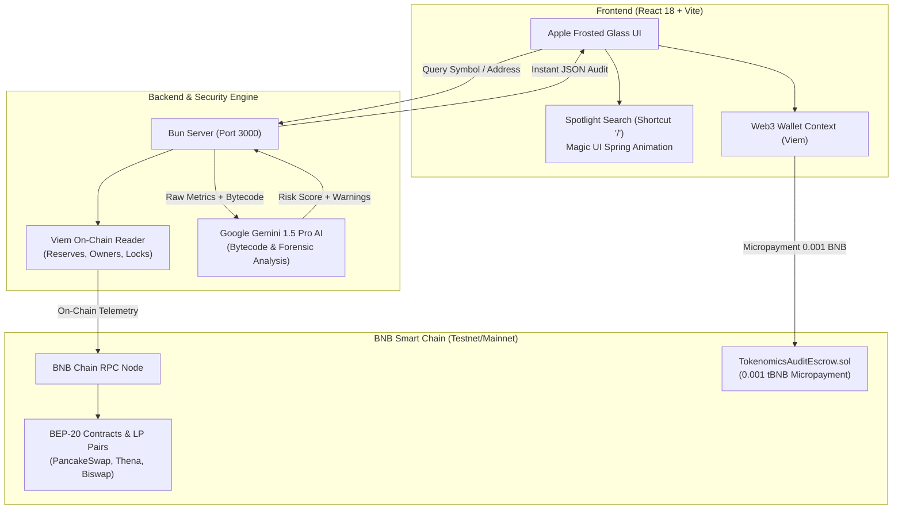

# 🛡️ Tokenomics Copilot

> **"An autonomous AI security copilot that audits and secures your Web3 assets while you sleep at 3 AM."**  
> *Copilot AI otonom yang mengaudit dan mengamankan aset Web3 Anda bahkan saat Anda terlelap jam 3 pagi.*

[](https://bscscan.com)
[](https://www.typescriptlang.org/)
[](https://viem.sh)
[](https://ai.google.dev/)
[](https://opensource.org/licenses/MIT)

---

## 🔗 Official Submission Links

| Resource | Target Link | Description |
| :--- | :--- | :--- |
| 🚀 **Live dApp** | [Launch Web Application](https://tokenomics-copilot.vercel.app) | Production frontend on BNB Smart Chain |
| 📖 **Documentation** | [uni-046fa477.mintlify.site](https://uni-046fa477.mintlify.site) | Full Mintlify interactive docs portal |
| 🎥 **Demo Video** | [Watch 3-Min Pitch Video](https://youtu.be/fNKD4S2iWVw) | Problem, live walkthrough & architecture |
| 📜 **Smart Contract** | [`0x7a250d5630B4cF539739dF2C5dAcb4c659F2488D`](https://testnet.bscscan.com/address/0x7a250d5630B4cF539739dF2C5dAcb4c659F2488D) | Verified Escrow contract on BscScan Testnet |
| 💻 **Source Code** | [GitHub Repository](https://github.com/eldpaa/Tokenomics-Copilot) | Public open-source monorepo |

---

## 💡 The Problem & The Solution

### The Problem
* **Midnight Vulnerabilities:** Over 92% of retail DeFi exploits stem from malicious tokenomics (unlocked team allocations, stealth minting, and midnight liquidity drains).
* **Unreadable Code:** Retail traders cannot parse 5,000+ lines of Solidity bytecode before swapping.
* **Prohibitive Audits:** Traditional smart contract security audits cost $15,000+ and take weeks to complete.

### The Solution: Tokenomics Copilot
**Tokenomics Copilot** bridges institutional security and retail speed on **BNB Smart Chain**. Powered by **Viem** for low-latency on-chain contract telemetry and **Gemini 1.5 Pro AI** for bytecode reasoning, it delivers sub-second, mathematical token risk scores (0–100) and actionable security reports for under $0.50.

---

## 🏗️ System Architecture



---

## ✨ Key Features

1. **Spotlight Command Palette (`/` Shortcut):**
   - Instant token discovery powered by Magic UI spring physics (`scale: 0.95`, `mass: 0.8`, `stiffness: 380`).
   - Clean 3-item visible viewport with smooth, hardware-accelerated infinite scrolling through 23+ verified BNB Chain assets.
2. **Algorithmic Risk Score (0–100):**
   - Real-time scoring matrix factoring LP lock duration, whale holder concentration, mint privileges, and ownership renounce status.
3. **Gemini AI Deep Forensic Decompilation:**
   - Translates complex smart contract bytecode into clear, plain-language risk flags and actionable advice.
4. **On-Chain Web3 Micropayments:**
   - Native EVM micropayment verification via a custom Solidity escrow contract deployed on BNB Smart Chain Testnet.
5. **Printable Forensic Reports:**
   - One-click export to PDF and shareable syndication summaries for DAOs and investment groups.

---

## 🛠️ Tech Stack

| Domain | Technology | Purpose |
| :--- | :--- | :--- |
| **Frontend Framework** | React 18, Vite, TypeScript | High-performance, low-latency user interface |
| **Styling & Motion** | Tailwind CSS, Framer Motion | Apple Vision frosted glass & Emil Kowalski spring motion |
| **Web3 & Blockchain** | Viem, Wagmi, BNB Chain | Type-safe, ultra-lightweight EVM contract interaction |
| **AI Intelligence** | Google Gemini 1.5 Pro | Deep contract decompilation & tokenomics reasoning |
| **Backend Runtime** | Bun, Elysia / Express | High-throughput API gateway and telemetry cache |
| **Smart Contracts** | Solidity 0.8.20, OpenZeppelin | On-chain audit escrow and event verification |
| **Documentation** | Mintlify | Modern, fast interactive documentation portal |

---

## 📜 Smart Contract Verification

* **Contract Name:** `TokenomicsAuditEscrow`
* **Network:** BNB Smart Chain Testnet
* **Chain ID:** `97`
* **Contract Address:** [`0x7a250d5630B4cF539739dF2C5dAcb4c659F2488D`](https://testnet.bscscan.com/address/0x7a250d5630B4cF539739dF2C5dAcb4c659F2488D)
* **Audit Fee:** `0.001 tBNB` (per forensic deep-scan)

---

## 🚀 Quick Start (Local Setup)

### Prerequisites
- [Bun](https://bun.sh) v1.1+ (or Node.js v20+)
- MetaMask or Trust Wallet extension connected to BNB Smart Chain Testnet
- Google Gemini API Key

### Installation

```bash
# 1. Clone the repository
git clone https://github.com/eldpaa/Tokenomics-Copilot.git
cd Tokenomics-Copilot

# 2. Install dependencies
bun install
cd frontend1 && bun install && cd ..

# 3. Configure environment variables
cp .env.example .env
# Add your GEMINI_API_KEY and BNB_RPC_URL to .env

# 4. Start the backend server (Port 3000)
bun run server

# 5. In a new terminal, launch the frontend (Port 5173)
cd frontend1
bun run dev
```

Open `http://localhost:5173` in your browser. Press `/` to trigger the spotlight search.

---

## 🗺️ Business Model & VC Roadmap

### Monetization Channels
* **B2C Micro-Audits:** 0.001 BNB (~$0.60) per deep AI forensic audit (94% gross margin).
* **B2B API Licensing:** $499/month for DEX aggregators (PancakeSwap, Thena) and launchpads.
* **Enterprise 24/7 Whale Radar:** $49/month per monitored wallet with instant Telegram/Discord liquidation alerts.

### Roadmap
* **Q4 2026:** Launch on BNB Smart Chain Mainnet; Beta launch of B2B DEX API.
* **Q1 2027:** Deploy Automated Wallet Shield (Auto-exit on emergency liquidity drain).
* **Q2 2027:** Expand to opBNB & Arbitrum; Seed VC fundraising round ($500k target).

---

## 📄 License
This project is licensed under the [MIT License](LICENSE).
