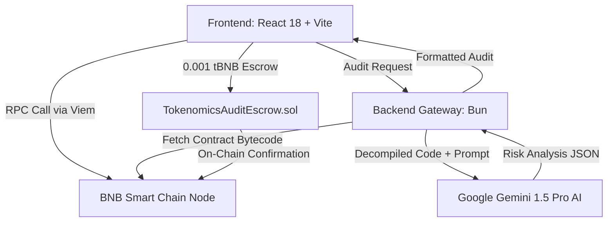

# Technical Architecture

Tokenomics Copilot is built on a 3-tier reactive pipeline designed to minimize latency while maintaining cryptographic verification.

## 1. High-Performance Frontend
* **Vite & React 18:** Near-instant hot module reloading and sub-50ms render times.
* **Apple Frosted Glass Theme:** Glassmorphism UI utilizing `backdrop-filter: blur(24px)` and dark theme palette `#08080B`.
* **Motion Physics:** Engineered with Framer Motion, adhering to Emil Kowalski's animation philosophy (`mass: 0.8`, `stiffness: 380`, `damping: 30`) with zero layout reflow thrashing.

## 2. On-Chain Telemetry (Viem)
* Instead of heavy legacy Web3 libraries, we utilize **Viem** for pure type-safe JSON-RPC interactions.
* Viem queries automated market maker (AMM) reserves directly from PancakeSwap V2 & V3 factory contracts.
* Reads multi-sig ownership, timelocks, and LP token holder balances simultaneously using batched multicall.

## 3. Gemini 1.5 Pro Intelligence Pipeline
* Raw telemetry, bytecode opcodes, and contract variables are structured into strict schema representations.
* Gemini 1.5 Pro evaluates the tokenomics against known exploit patterns:
  * **Honeypot detection:** Checks for modified `transferFrom` methods that prevent sells.
  * **Fee traps:** Detects variable sell tax functions that can be adjusted up to 100%.
  * **Whale concentration:** Flags when top 10 non-contract wallets control over 40% of the circulating float.
