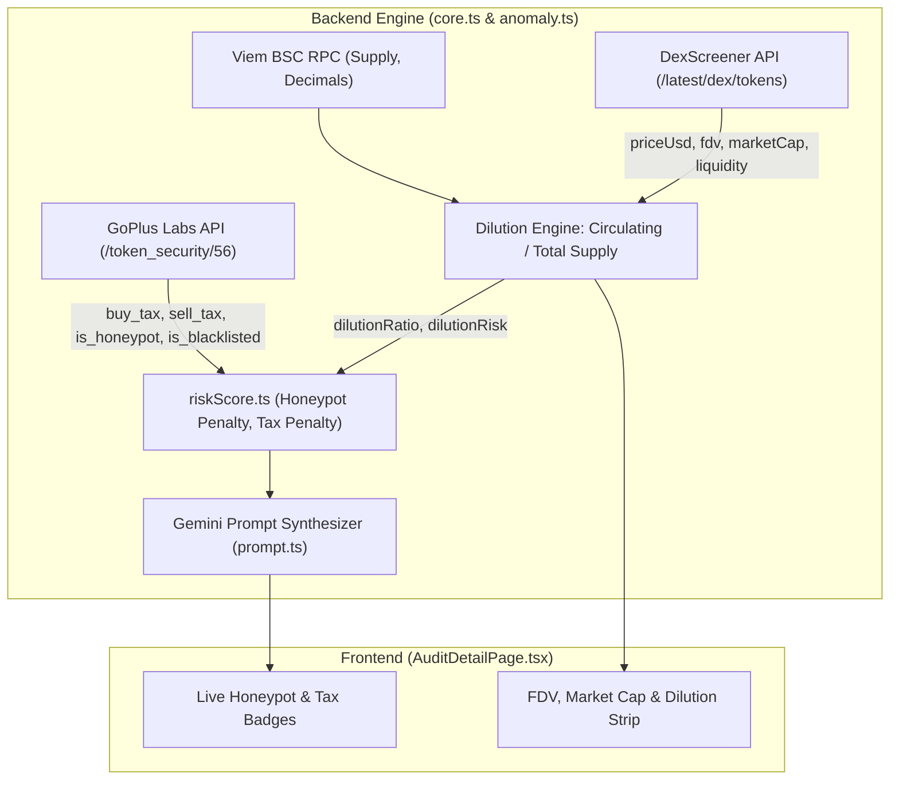

## Goal Capsule

- **Objective:** Ground Tokenomics Copilot's security and financial analysis in verifiable, real-time on-chain data by integrating live Honeypot/Tax security signals and DexScreener market dilution metrics into the backend analysis engine and frontend UI.
- **Means:** Extend `backend/anomaly.ts` to query GoPlus Token Security API for live tax/honeypot/blacklist status and DexScreener API for live price, market cap, and FDV; propagate these signals to `riskScore.ts`, `prompt.ts`, and frontend types, then surface live security badges and a new Tokenomics Dilution Risk metric card in `AuditDetailPage.tsx`.
- **Stop Condition:** `backend/anomaly.ts` returns real GoPlus security checks (`buyTax`, `sellTax`, `isHoneypot`, `isBlacklisted`) and DexScreener financial metrics (`fdv`, `marketCap`, `dilutionRatio`, `dilutionRisk`); `backend/riskScore.ts` penalizes honeypot tokens and high tax; `AuditDetailPage.tsx` displays live security badges and the Dilution Risk card; automated tests pass.

---

## Product Contract

### Summary
Currently, Tokenomics Copilot provides AI fundamental analysis and on-chain whale/LP lock signals on BNB Chain. However, the Honeypot Scanner, Transfer Tax, and Blacklist status in the frontend are hardcoded static placeholders. Additionally, the tokenomics assessment only observes raw Total Supply without evaluating live Market Cap, Fully Diluted Valuation (FDV), or the Dilution Ratio (Circulating Supply vs Total Supply), leaving users vulnerable to "Low Float, High FDV" dump traps. 

This plan implements Phase 1: integrating live GoPlus Token Security telemetry to detect honeypots, taxes, and blacklists, and querying DexScreener's free market API to compute live FDV, Market Cap, and Dilution Ratios, surfacing dynamic security badges and an executive tokenomics financial strip on the web dashboard.

### Problem Frame
1. **False Sense of Security:** The UI displays "Passed (Tradeable)" and "0% Buy / 0% Sell Tax" statically. If an audited token is a malicious honeypot with a 99% sell tax or an active blacklist, the UI currently misinforms users.
2. **Missing Economic Reality:** A token with a $10M Market Cap appears cheap, but if 95% of the supply is locked and vesting to insiders, the $200M FDV represents an imminent sell-off risk. Users have no visibility into circulating float vs total supply dilution.

### Requirements

#### GoPlus Security & Honeypot Engine
- R1. The backend must query GoPlus Token Security API (`https://api.gopluslabs.io/api/v1/token_security/56?contract_addresses=<address>`) to extract `is_honeypot`, `buy_tax`, `sell_tax`, `is_blacklisted`, `is_mintable`, and `can_take_back_ownership`.
- R2. If GoPlus API is unreachable or rate-limited, the system must gracefully fall back to `available: false` with descriptive error notes rather than crashing the audit flow.
- R3. The risk scoring engine (`backend/riskScore.ts`) must strictly penalize honeypots (forcing High Risk / deducting 50 points) and apply penalties for taxes exceeding 10% or active blacklists.

#### Tokenomics Financial & Dilution Metrics
- R4. The backend must query DexScreener free endpoint (`https://api.dexscreener.com/latest/dex/tokens/<address>`) to obtain live token price, liquidity, FDV, and pair data on BSC.
- R5. The backend must calculate the Dilution Ratio:
  $$\text{Dilution Ratio} = \left( \frac{\text{Circulating Supply}}{\text{Total Supply}} \right) \times 100\%$$
  where Circulating Supply is derived from $\frac{\text{Market Cap}}{\text{Price}}$ (or total supply minus known lock/burn addresses if market cap is unavailable).
- R6. The backend must categorize Dilution Risk:
  - $\ge 70\%$: `LOW` (Healthy circulating float)
  - $30\% - 69.9\%$: `MODERATE`
  - $< 30\%$: `HIGH` (High dilution / low float dump trap risk)

#### Frontend Presentation
- R7. `frontend1/src/pages/AuditDetailPage.tsx` must display real data for the Honeypot Scanner, Transfer Tax, and Blacklist Function badges based on `onChainSignals.securityChecks`.
- R8. `frontend1/src/pages/AuditDetailPage.tsx` must display a dedicated Tokenomics Financial Metrics section showing Price, Market Cap, FDV, Circulating Supply %, and a colored Dilution Risk badge with an informative tooltip.

### Scope Boundaries

#### In Scope
- GoPlus Security API integration in `backend/anomaly.ts`.
- DexScreener market data retrieval and Dilution Ratio calculation in `backend/anomaly.ts`.
- Updating `backend/riskScore.ts` and `backend/prompt.ts` to reflect real security and dilution metrics.
- Synchronizing shared types in `backend/core.ts` and `frontend1/src/lib/types.ts`.
- Replacing static security badges with live dynamic data in `frontend1/src/pages/AuditDetailPage.tsx`.
- Adding new financial metric cards (FDV, Market Cap, Dilution Ratio, Dilution Risk) in `AuditDetailPage.tsx`.
- Automated test coverage for security extraction, dilution calculations, and score penalties.

#### Deferred to Follow-Up Work
- Multi-chain opBNB network switching (Fase 2).
- Real Web3 micro-payment on-chain via Viem browser wallet (Fase 3).
- Interactive "What-If" whale sell pressure simulator widget.

---

## Planning Contract

### Key Technical Decisions

- KTD1. **GoPlus API Consolidation:** `checkHolderConcentration` in `backend/anomaly.ts` already calls GoPlus for `holder_count`. We will consolidate all GoPlus queries into a dedicated `checkTokenSecurity` function to avoid redundant HTTP requests and prevent rate-limiting.
- KTD2. **Zero-API-Key Market Data via DexScreener:** Use DexScreener public REST endpoint (`https://api.dexscreener.com/latest/dex/tokens/:tokenAddress`). It is free, requires no API key, handles BSC tokens natively, and returns pair liquidity, FDV, and price in USD. If a token has multiple pairs, select the pair with the highest `liquidity.usd`.
- KTD3. **Safe Circulating Supply Estimation:** When Market Cap is directly returned by DexScreener, calculate $\text{Circulating Supply} = \text{Market Cap} / \text{Price}$. When Market Cap is null or 0, fallback to $\text{Circulating Supply} = \text{Total Supply} \times (1 - \text{LP Burn/Lock \%})$.
- KTD4. **Strict Honeypot Penalty in Risk Scoring:** If `is_honeypot` is true, deduct 50 points and clamp maximum risk score to 30 (`🔴 High Risk`), ensuring an obvious honeypot can never receive a Medium or Low Risk badge.

### High-Level Technical Design



### Assumptions
- GoPlus Security API free public tier remains accessible for BSC contract addresses without mandatory authentication headers.
- DexScreener token endpoint provides liquidity and FDV for all active PancakeSwap pairs.
- For newly deployed tokens with no DEX pairs yet, DexScreener will return empty pairs; the system must gracefully mark financial metrics as `available: false` with fallback note "No DEX liquidity pair found".

---

## Implementation Units

### U1. Backend Token Security Engine (GoPlus Honeypot & Tax Extraction)
- **Goal:** Implement live honeypot, tax, and blacklist extraction from GoPlus Security API in `backend/anomaly.ts`.
- **Requirements:** R1, R2
- **Dependencies:** None
- **Files:**
  - `backend/anomaly.ts`
  - `tests/backend-security.test.ts`
- **Approach:**
  1. Define `TokenSecurityCheck` type:
     ```ts
     export type TokenSecurityCheck = {
         available: boolean;
         isHoneypot: boolean | null;
         buyTaxPercent: number | null;
         sellTaxPercent: number | null;
         isBlacklisted: boolean | null;
         isMintable: boolean | null;
         canTakeBackOwnership: boolean | null;
         isOpenSource: boolean | null;
         note: string;
     };
     ```
  2. Implement `checkTokenSecurity(tokenAddress: string): Promise<TokenSecurityCheck>`.
  3. Parse GoPlus response: `is_honeypot === "1"`, `buy_tax` parsed as percentage float, `sell_tax` parsed as percentage float, `is_blacklisted === "1"`.
  4. Reuse existing `retry` utility from `backend/utils.ts` for network resilience.
- **Test scenarios:**
  - Happy path: Token with 0% buy/sell tax and no honeypot returns `isHoneypot: false`, `buyTaxPercent: 0`, `sellTaxPercent: 0`.
  - Honeypot path: Token with `is_honeypot: "1"` returns `isHoneypot: true` with warning note.
  - High tax path: Token with 25% sell tax returns `sellTaxPercent: 25`.
  - Network error path: API timeout/failure returns `available: false` without throwing an uncaught exception.
- **Verification:** Run `bun test tests/backend-security.test.ts` and verify all security checks pass.

---

### U2. Backend Market & Dilution Engine (DexScreener API)
- **Goal:** Implement live pricing, Market Cap, FDV, and Dilution Ratio calculation in `backend/anomaly.ts`.
- **Requirements:** R4, R5, R6
- **Dependencies:** None
- **Files:**
  - `backend/anomaly.ts`
  - `tests/backend-financials.test.ts`
- **Approach:**
  1. Define `TokenFinancialMetrics` type:
     ```ts
     export type TokenFinancialMetrics = {
         available: boolean;
         priceUsd: number | null;
         marketCapUsd: number | null;
         fdvUsd: number | null;
         circulatingSupply: number | null;
         dilutionRatio: number | null;
         dilutionRisk: "LOW" | "MODERATE" | "HIGH" | "UNAVAILABLE";
         liquidityUsd: number | null;
         note: string;
     };
     ```
  2. Implement `checkFinancialMetrics(tokenAddress: string, totalSupplyFormatted: string): Promise<TokenFinancialMetrics>`.
  3. Fetch `https://api.dexscreener.com/latest/dex/tokens/${tokenAddress}`.
  4. Select the highest liquidity pair on `bsc`.
  5. Compute `dilutionRatio = (circulatingSupply / totalSupply) * 100`.
  6. Assign `dilutionRisk`: `LOW` ($\ge 70\%$), `MODERATE` ($30-69\%$), `HIGH` ($< 30\%$).
- **Test scenarios:**
  - Standard token: CAKE returns valid price, FDV, market cap, and dilution ratio.
  - Low float token: Circulating supply 10% of total returns `dilutionRisk: "HIGH"`.
  - Unlisted token: Empty pair returns `available: false` and `dilutionRisk: "UNAVAILABLE"`.
- **Verification:** Run `bun test tests/backend-financials.test.ts` and verify accurate dilution categorization.

---

### U3. Risk Scoring & AI Prompt Enrichment
- **Goal:** Incorporate live honeypot, tax, and dilution signals into `backend/riskScore.ts` and `backend/prompt.ts`.
- **Requirements:** R3
- **Dependencies:** U1, U2
- **Files:**
  - `backend/riskScore.ts`
  - `backend/prompt.ts`
  - `backend/core.ts`
  - `tests/riskScore.test.ts`
- **Approach:**
  1. Update `hitungRiskScore` in `backend/riskScore.ts`:
     - If `signals.securityChecks.isHoneypot === true`: deduct 50 points and cap score at 30 (`🔴 High Risk`).
     - If `signals.securityChecks.sellTaxPercent > 10`: deduct 15 points.
     - If `signals.financialMetrics.dilutionRisk === "HIGH"`: deduct 10 points.
  2. Update `formatAnomalySignalsForPrompt` in `backend/prompt.ts` to include:
     - `- Honeypot Status: ${isHoneypot ? "CRITICAL: HONEYPOT DETECTED" : "PASSED (Tradeable)"}`
     - `- Transfer Tax: Buy ${buyTax}%, Sell ${sellTax}%`
     - `- Market Valuation & Dilution: FDV $${fdv}, Market Cap $${mc}, Dilution Ratio ${ratio}% (${dilutionRisk})`
  3. Include `securityChecks` and `financialMetrics` inside `jalankanSemuaAnomalyCheck` in `backend/anomaly.ts`.
- **Test scenarios:**
  - Scoring penalty: Honeypot token drops total score below 30 regardless of whale accumulation or ownership.
  - Tax penalty: 15% sell tax token has score reduced by 15 points.
  - Prompt format: Formatted anomaly prompt text contains both Honeypot and Dilution status lines.
- **Verification:** Run `bun test tests/riskScore.test.ts` to verify mathematical scoring bounds.

---

### U4. Shared Frontend Types & Formatting Helpers
- **Goal:** Synchronize data contracts between backend and frontend, and add financial formatting utilities.
- **Requirements:** R7, R8
- **Dependencies:** U1, U2
- **Files:**
  - `frontend1/src/lib/types.ts`
  - `frontend1/src/lib/format.ts`
- **Approach:**
  1. Add `TokenSecurityCheck` and `TokenFinancialMetrics` interfaces to `frontend1/src/lib/types.ts`.
  2. Update `AnomalySignals` interface in `frontend1/src/lib/types.ts` to include `securityChecks` and `financialMetrics`.
  3. Add `formatCurrency(num: number | null): string` in `frontend1/src/lib/format.ts` (e.g. `$1.24M`, `$540.2K`).
  4. Add `formatPercent(num: number | null): string` in `frontend1/src/lib/format.ts`.
- **Test scenarios:**
  - Formatting check: `formatCurrency(1250000)` produces `"$1.25M"`.
  - Formatting check: `formatCurrency(null)` produces `"N/A"`.
  - Typecheck: Run `bun run build` in `frontend1/` to ensure no interface mismatches.
- **Verification:** Run `cd frontend1 && bun run build` without TypeScript errors.

---

### U5. Frontend Live Security Badges & Tooltips
- **Goal:** Wire dynamic security telemetry into the security badge panel in `frontend1/src/pages/AuditDetailPage.tsx`.
- **Requirements:** R7
- **Dependencies:** U4
- **Files:**
  - `frontend1/src/pages/AuditDetailPage.tsx`
- **Approach:**
  1. Replace hardcoded text in lines 938-1040 of `AuditDetailPage.tsx`:
     - **Honeypot Scanner:** Inspect `token.onChainSignals?.securityChecks?.isHoneypot`.
       - If `true`: Red icon, `"FAILED (Honeypot Detected)"`, text-rose-500.
       - If `false`: Green icon, `"Passed (Tradeable)"`, text-emerald-500.
       - If `null`: Amber icon, `"Unverifiable"`.
     - **Transfer Tax:** Display `${token.onChainSignals?.securityChecks?.buyTaxPercent ?? 0}% Buy / ${token.onChainSignals?.securityChecks?.sellTaxPercent ?? 0}% Sell`.
       - If either tax > 10%, display warning styling.
     - **Blacklist Function:** Inspect `token.onChainSignals?.securityChecks?.isBlacklisted`.
       - If `true`: `"Active Blacklist Detected"`, text-rose-500.
       - If `false`: `"None Detected"`, text-emerald-500.
  2. Update tooltips to explain live GoPlus on-chain telemetry.
- **Test scenarios:**
  - Clean token displays green passed badges.
  - Malicious/tax token displays accurate tax percentages and red/amber indicators.
- **Verification:** Inspect browser rendering of audited token to verify badge reflects API payload.

---

### U6. Frontend Tokenomics Financial & Dilution Metrics Card
- **Goal:** Render an executive financial and dilution metrics strip in `frontend1/src/pages/AuditDetailPage.tsx`.
- **Requirements:** R8
- **Dependencies:** U4, U5
- **Files:**
  - `frontend1/src/pages/AuditDetailPage.tsx`
- **Approach:**
  1. Add a new card component above or alongside the On-Chain Signal Badges in `AuditDetailPage.tsx`:
     - **Price:** Live USD price formatted with appropriate decimals.
     - **Market Cap:** Formatted via `formatCurrency`.
     - **FDV (Fully Diluted):** Formatted via `formatCurrency`.
     - **Circulating Float:** e.g., `42.5% of Total Supply`.
     - **Dilution Risk Badge:**
       - `🟢 Low Dilution Risk` ($\ge 70\%$)
       - `🟡 Moderate Dilution Risk` ($30-69\%$)
       - `🔴 High Dilution Risk` ($< 30\%$)
  2. Include an interactive tooltip on the Dilution Risk badge explaining: *"Tokens with low circulating float (< 30%) have significant future vesting unlock pressure that can depress secondary market prices."*
- **Test scenarios:**
  - High dilution token displays prominent red warning badge and tooltip.
  - Healthy token displays green badge.
  - Token with no DEX pair displays graceful "Metrics Unavailable" fallback.
- **Verification:** Visual verification on `http://localhost:5173/audit/CAKE`.

---

## Verification Contract

| Target | Verification Command | Done Signal |
| :--- | :--- | :--- |
| Backend Security Tests | `bun test tests/backend-security.test.ts` | Pass (all Honeypot/Tax scenarios verified) |
| Backend Financial Tests | `bun test tests/backend-financials.test.ts` | Pass (DexScreener parsing & dilution ratios verified) |
| Backend Risk Scoring Tests | `bun test tests/riskScore.test.ts` | Pass (Honeypot -50 penalty verified) |
| Frontend Typecheck & Build | `cd frontend1 && bun run build` | Zero type errors, bundle compiled successfully |
| E2E Verification | `bun dev:backend` + audit query | Response JSON contains `securityChecks` and `financialMetrics` |

---

## Definition of Done

- [ ] `backend/anomaly.ts` exports `checkTokenSecurity` querying GoPlus API for `is_honeypot`, `buy_tax`, `sell_tax`, `is_blacklisted`.
- [ ] `backend/anomaly.ts` exports `checkFinancialMetrics` querying DexScreener for `priceUsd`, `fdv`, `marketCap`, `dilutionRatio`, `dilutionRisk`.
- [ ] `backend/riskScore.ts` penalizes honeypot tokens with a 50-point deduction and caps total score at 30.
- [ ] `backend/prompt.ts` injects honeypot, tax, and dilution figures into the Gemini AI analysis prompt.
- [ ] `frontend1/src/lib/types.ts` defines `TokenSecurityCheck` and `TokenFinancialMetrics` contracts.
- [ ] `frontend1/src/pages/AuditDetailPage.tsx` displays live honeypot, tax, and blacklist badges.
- [ ] `frontend1/src/pages/AuditDetailPage.tsx` displays the Tokenomics Financial Metrics strip (FDV, Market Cap, Dilution Ratio, Dilution Risk badge).
- [ ] All automated tests pass with `bun test`.
