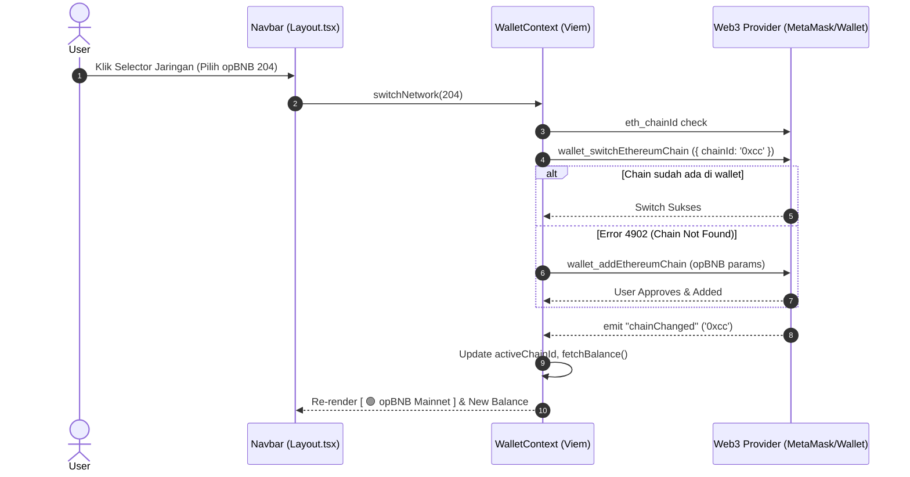

## Goal Capsule

- **Objective:** Enable users to seamlessly switch between BNB Smart Chain (L1) and opBNB (L2) within the Web3 wallet and app interface, viewing network-appropriate balances and on-chain telemetry.
- **Means:** Multi-Chain EIP-3326 network switching and EIP-3085 chain registration in `walletContext.tsx`, combined with an Apple Crystal Glass-styled network switcher dropdown in `Layout.tsx` and chain-aware Viem clients. (KTD1, KTD2)
- **Authority Hierarchy:** Product Contract > Planning Contract > Implementation Units.
- **Stop Conditions:** User can switch chains between BSC (56) and opBNB (204) directly from the UI dropdown; wallet prompts network change; UI updates active chain pill, balance, and explorer links accordingly; gracefully prompts chain addition if opBNB is not configured in the user's wallet.

---

## Product Contract

### Summary
Tokenomics Copilot is built for the BNB Chain ecosystem. While BSC (Chain ID 56) is the primary liquidity hub, opBNB (Chain ID 204) is the ultra-low-gas, high-throughput Layer 2 essential for high-frequency micro-payments and next-generation Web3 applications. This plan delivers a **Multi-Chain Network Switcher** allowing users to toggle between BSC and opBNB with live wallet state synchronization, network auto-detection, and graceful chain addition prompts.

### Problem Frame
Currently, the application hardcodes BNB Smart Chain and assumes the connected wallet is on BSC. Users who are already connected to opBNB or another network see confusing balances or fail on-chain transactions without clear feedback. There is no UI affordance to switch chains, inspect which network is active, or add opBNB to MetaMask/Trust Wallet automatically.

### Requirements

#### Network Definitions & Wallet Provider
- R1. Daftarkan konfigurasi chain resmi untuk **BNB Smart Chain (L1, Chain ID 56 / 0x38)** dan **opBNB Mainnet (L2, Chain ID 204 / 0xcc)** mencakup RPC endpoints, chain names, native currency (BNB), dan block explorer URLs.
- R2. Di `walletContext.tsx`, sediakan state `activeChainId`, `activeChainName`, `isUnsupportedNetwork`, dan metode `switchNetwork(targetChainId: number): Promise<boolean>`.
- R3. Implementasikan standar `wallet_switchEthereumChain` (EIP-3326) dengan fallback otomatis ke `wallet_addEthereumChain` (EIP-3085) jika opBNB belum terdaftar di dompet pengguna (kode error 4902).
- R4. Tangani event `chainChanged` dari provider `window.ethereum` secara reaktif agar saldo, nama jaringan, dan status visual langsung sinkron tanpa perlu refresh halaman manual.

#### Navbar UI & UX Integration
- R5. Di header bar navigasi ([`Layout.tsx`](frontend1/src/components/shared/Layout.tsx)), tampilkan dropdown pemilih jaringan di samping tombol status dompet dengan desain Crystal Glass:
  - Opsi: `🟡 BNB Smart Chain` (Chain ID 56)
  - Opsi: `🟢 opBNB Mainnet` (Chain ID 204)
- R6. Tampilkan indikator peringatan visual (`⚠️ Unsupported Network`) jika pengguna terhubung ke chain lain (misal Ethereum Mainnet, Polygon, Arbitrum), disertai tombol 1-klik untuk beralih kembali ke BSC atau opBNB.

#### Scope Boundaries
- **In Scope:** Frontend wallet multi-chain switching, Viem chain configuration, Navbar network dropdown, dynamic balance fetching per active chain, and chain-aware explorer link generation.
- **Deferred for Later (Phase 3):** Smart contract micro-payment escrow on opBNB and cross-chain bridging telemetry.

---

## Planning Contract

### Key Technical Decisions

- KTD1. **Client-Side EIP-3326 & EIP-3085 Protocol:** Gunakan RPC wallet standar (`wallet_switchEthereumChain` dan `wallet_addEthereumChain`) langsung dari `walletContext.tsx`. Ini memastikan kompatibilitas penuh dengan MetaMask, Trust Wallet, Binance Web3 Wallet, OKX Wallet, dan Rabby tanpa ketergantungan library eksternal yang membengkakkan bundle.
  (session-settled: user-directed — chosen over rigid Wagmi refactor: mempertahankan kesederhanaan arsitektur Viem murni yang sudah stabil).
- KTD2. **Shared Chain Registry Specification:**
  - **BSC Mainnet:** Chain ID `56` (`0x38`), RPC `https://bsc-dataseed.binance.org`, Explorer `https://bscscan.com`.
  - **opBNB Mainnet:** Chain ID `204` (`0xcc`), RPC `https://opbnb-mainnet-rpc.bnbchain.org`, Explorer `https://opbnbscan.com`.
- KTD3. **Navbar Dropdown Micro-Interaction:** Terapkan dropdown floating modal dengan click-outside listener, animasi Apple Spring ease-out, dot status bercahaya (glow), dan haptic-style visual response.

### Technical Architecture & Sequence Flow

### Assumptions
- Pengguna menggunakan browser Web3 extension modern yang mendukung EIP-1193, EIP-3326, dan EIP-3085.
- Native token pada kedua chain adalah BNB (18 decimals), sehingga rumus parsing balance `eth_getBalance` tetap konsisten (`${balance} BNB`).

---

## Implementation Units

### U1. Multi-Chain Definitions & Types Configuration
- **Goal:** Definisikan tipe dan konstanta jaringan terpusat untuk BSC dan opBNB.
- **Requirements Covered:** R1
- **Files Touched:**
  - `frontend1/src/lib/chains.ts` (new)
  - `frontend1/src/lib/types.ts`
- **Approach:**
  - Buat `frontend1/src/lib/chains.ts` yang mengekspor konfigurasi `SUPPORTED_CHAINS`:
    - Chain ID 56: BSC (`name: "BNB Smart Chain"`, `shortName: "BSC"`, `color: "#F3BA2F"`, `icon: "🟡"`, `explorerUrl: "https://bscscan.com"`)
    - Chain ID 204: opBNB (`name: "opBNB Mainnet"`, `shortName: "opBNB"`, `color: "#00E599"`, `icon: "🟢"`, `explorerUrl: "https://opbnbscan.com"`)
  - Sediakan helper `isSupportedChain(chainId: number): boolean` dan `getChainMetadata(chainId: number)`.
- **Test Scenarios:**
  - Chain ID 56 dan 204 mengembalikan metadata yang benar.
  - Chain ID yang tidak dikenal (misal 1, 137) mengembalikan `null` atau `isSupported = false`.

### U2. WalletContext Multi-Chain State & Switcher
- **Goal:** Lengkapi `WalletContext` dengan kemampuan deteksi jaringan dan perpindahan chain otomatis.
- **Requirements Covered:** R2, R3, R4
- **Files Touched:**
  - `frontend1/src/lib/walletContext.tsx`
- **Approach:**
  - Tambahkan state: `chainId: number | null`, `activeChain: ChainMetadata | null`, `isSwitchingNetwork: boolean`, `isUnsupportedNetwork: boolean`.
  - Pada saat connect atau inisialisasi, panggil `window.ethereum.request({ method: 'eth_chainId' })` dan parse ke integer desimal.
  - Implementasikan fungsi `switchNetwork(targetChainId: number)`:
    - Ubah angka desimal ke hex string (56 -> `0x38`, 204 -> `0xcc`).
    - Panggil `wallet_switchEthereumChain`.
    - Jika error `code === 4902` atau pesan mengandung "Unrecognized chain", panggil `wallet_addEthereumChain` dengan parameter RPC opBNB.
  - Daftarkan listener `window.ethereum.on('chainChanged', ...)` untuk memperbarui `chainId` dan mengambil ulang saldo.
- **Test Scenarios:**
  - Panggilan `switchNetwork(204)` memicu request `wallet_switchEthereumChain` dengan `0xcc`.
  - Jika error 4902 terjadi, memicu request `wallet_addEthereumChain` dengan RPC `https://opbnb-mainnet-rpc.bnbchain.org`.
  - Event `chainChanged` memperbarui state context tanpa reload paksa.

### U3. Navbar Network Selector Dropdown Component
- **Goal:** Hadirkan antarmuka dropdown pemilih jaringan yang elegan di header navigasi.
- **Requirements Covered:** R5, R6
- **Files Touched:**
  - `frontend1/src/components/shared/NetworkSwitcher.tsx` (new)
  - `frontend1/src/components/shared/Layout.tsx`
- **Approach:**
  - Buat komponen `NetworkSwitcher`:
    - Jika dompet belum terhubung: tampilkan pill non-aktif atau default `🟡 BNB Chain`.
    - Jika terhubung ke jaringan didukung: tampilkan badge nama jaringan aktif dengan indikator titik menyala (`🟡 BSC` / `🟢 opBNB`) dan panah dropdown chevron.
    - Jika terhubung ke jaringan tidak didukung: tampilkan pill merah berkedip `⚠️ Unsupported Network`.
    - Dropdown popup menampilkan daftar chain dengan radio visual, deskripsi kecepatan/gas fee ("L1 Primary Hub" vs "L2 Ultra-Low Gas"), dan feedback loading saat switching.
  - Pasang `NetworkSwitcher` di `Layout.tsx` tepat di samping tombol wallet.
- **Test Scenarios:**
  - Dropdown terbuka saat tombol diklik dan tertutup jika pengguna mengklik area luar.
  - Mengklik opsi jaringan lain memanggil `switchNetwork`.
  - State jaringan yang tidak didukung menampilkan badge peringatan merah.

### U4. Dynamic Explorer Links & Token Detail Page Integration
- **Goal:** Pastikan link penjelajah blok (block explorer) di halaman audit menyesuaikan jaringan yang aktif.
- **Requirements Covered:** R1, R5
- **Files Touched:**
  - `frontend1/src/pages/AuditDetailPage.tsx`
- **Approach:**
  - Ganti link hardcoded `https://bscscan.com/token/...` dengan pemanggilan dinamis berbasis `activeChain.explorerUrl`.
  - Jika token diaudit di opBNB, tautan otomatis mengarah ke `https://opbnbscan.com/token/...`.
- **Test Scenarios:**
  - Pada BSC, link mengarah ke BscScan.
  - Pada opBNB, link mengarah ke opBnbScan.

---

## Verification Contract

### Test & Execution Verification Commands
- Frontend Build & Type Check: `cd frontend1 && bun run build`
- Unit Test Run: `bun test tests/multichain.test.ts`
- Manual Verification Checklist:
  1. Hubungkan MetaMask/Wallet ke BSC -> Navbar menampilkan `🟡 BNB Smart Chain` dan saldo BSC.
  2. Buka dropdown di Navbar -> Pilih `🟢 opBNB Mainnet` -> Wallet popup meminta konfirmasi switch network.
  3. Konfirmasi di wallet -> Navbar berubah menampilkan `🟢 opBNB Mainnet` dan saldo opBNB.
  4. Pindah jaringan manual di MetaMask ke Ethereum Mainnet -> Navbar menampilkan badge merah `⚠️ Unsupported Network`. Klik badge -> Menampilkan prompt switch kembali ke BSC/opBNB.

---

## Definition of Done

- [ ] File konfigurasi `SUPPORTED_CHAINS` selesai dibuat dan teruji.
- [ ] `walletContext.tsx` mendukung `switchNetwork`, `chainChanged`, dan auto-add opBNB via EIP-3085.
- [ ] Komponen `NetworkSwitcher` terintegrasi mulus di `Layout.tsx` Navbar dengan tema Apple Crystal Glass.
- [ ] Halaman `AuditDetailPage.tsx` menggunakan link block explorer dinamis sesuai chain aktif.
- [ ] Zero TypeScript errors pada `bun run build`.
