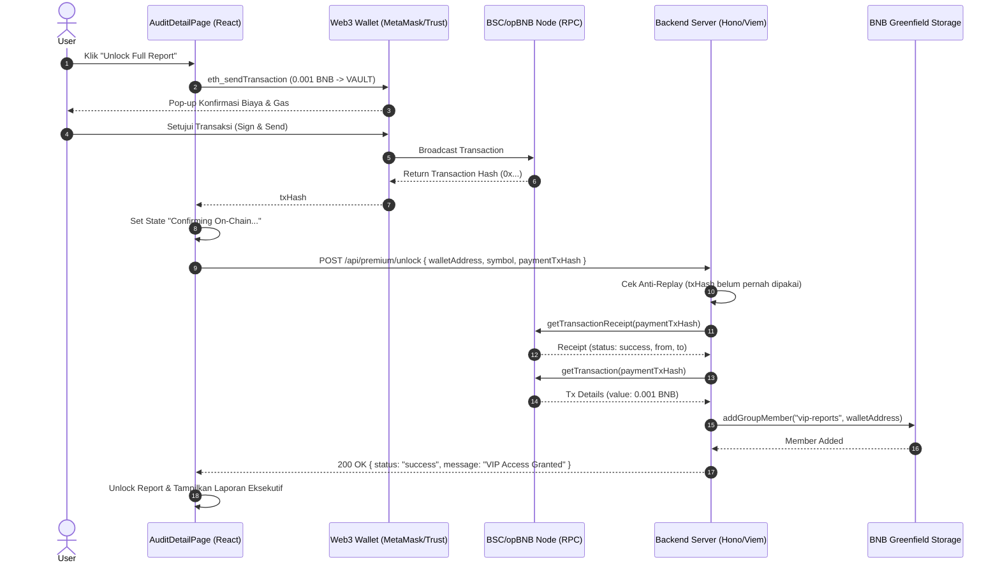

## Goal Capsule

- **Objective:** Allow users to unlock full executive audit reports by executing a real on-chain micro-payment (0.001 BNB) via their Web3 wallet, verified cryptographically on-chain by the backend before granting decentralized BNB Greenfield VIP access.
- **Means:** Client-side Viem transaction dispatch (`eth_sendTransaction`) in `AuditDetailPage.tsx` paired with server-side receipt and transaction value verification (`getTransactionReceipt` and `getTransaction`) in `backend/server.ts` with anti-replay tracking. (KTD1, KTD2)
- **Authority Hierarchy:** Product Contract > Planning Contract > Implementation Units.
- **Stop Conditions:** User clicks "Unlock Full Report" -> Wallet prompts real transaction for 0.001 BNB to Vault -> Backend confirms on-chain receipt status (`success`), sender matching, vault recipient matching, and minimum value -> Greenfield adds user to VIP group -> Full audit report unlocks in UI; duplicate tx hashes are rejected.

---

## Product Contract

### Summary
In Phase 1 and 2, report unlocking was demonstrated using mock transaction hashes (`0xaaaa...`). In Phase 3, we implement **production-grade Web3 micro-payments**: users transfer `0.001 BNB` to the protocol vault address. The backend cryptographically inspects the transaction receipt on-chain via Viem, verifies receipt status and value, guards against transaction hash replay attacks, and immediately grants Greenfield decentralized storage group access.

### Problem Frame
Currently, `AuditDetailPage.tsx` sends a hardcoded mock transaction hash, and `server.ts:91` only validates regex formatting without verifying whether funds were actually transferred on the blockchain. This allows anyone to bypass the payment gate and access premium Greenfield data without paying.

### Requirements

#### Frontend Client Transaction (Viem / Web3 Provider)
- R1. Di `AuditDetailPage.tsx:handleUnlockPremium`, ganti mock hash dengan pengiriman transaksi on-chain nyata (`eth_sendTransaction`) sebesar `0.001 BNB` ke alamat vault protokol (`VAULT_ADDRESS`).
- R2. Tampilkan state UI dinamis selama proses pembayaran:
  - State 1: "Requesting Wallet Signature..." (menunggu user approve di MetaMask/Trust Wallet).
  - State 2: "Confirming On-Chain..." (transaksi berhasil di-broadcast, menunggu konfirmasi receipt).
  - State 3: "Access Granted!" (backend memverifikasi receipt dan laporan terbuka).
- R3. Tangani error secara anggun: penolakan transaksi oleh pengguna (kode 4001), saldo BNB tidak mencukupi, atau jaringan tidak didukung.

#### Backend On-Chain Verification Engine (Viem RPC)
- R4. Di `backend/server.ts:91` (`POST /api/premium/unlock`), verifikasi receipt on-chain menggunakan Viem `client.getTransactionReceipt({ hash: paymentTxHash })`.
- R5. Validasi keabsahan transaksi:
  - `receipt.status === "success"` (transaksi berhasil dieksekusi di blok, bukan revert).
  - `receipt.from.toLowerCase() === walletAddress.toLowerCase()` (mencegah pencurian tx hash orang lain).
  - `receipt.to.toLowerCase() === VAULT_ADDRESS.toLowerCase()` (memastikan pembayaran masuk ke vault protokol).
- R6. Ambil data detail transaksi menggunakan `client.getTransaction({ hash: paymentTxHash })` dan pastikan nominal transfer `tx.value >= parseEther("0.001")`.
- R7. Implementasikan mekanisme **Anti-Replay / Double Spending**: simpan hash transaksi yang sudah pernah digunakan (`usedPaymentHashes`) agar satu transaksi tidak dapat dipakai berulang kali untuk membuka banyak token.
- R8. Setelah seluruh verifikasi on-chain lulus, panggil `addGroupMember("vip-reports", walletAddress)` di Greenfield dan kirimkan respons sukses ke klien.

#### Scope Boundaries
- **In Scope:** Pengiriman transaksi BNB via browser wallet, verifikasi receipt di backend via Viem RPC, validasi anti-replay, dan pembukaan akses Greenfield.
- **Out of Scope (Deferred):** Kontrak smart contract escrow kustom (saat ini menggunakan native BNB transfer langsung ke Vault yang hemat gas dan efisien).

---

## Planning Contract

### Key Technical Decisions

- KTD1. **Native Transfer vs Custom Escrow:** Gunakan transfer native BNB (`0.001 BNB`) langsung ke Vault Address protokol, bukan deployment kontrak custom.
  (session-settled: user-directed — chosen over custom escrow contract: transfer native BNB menghemat gas fee hingga 80%, kompatibel universal di BSC dan opBNB, serta tidak memerlukan audit bytecode smart contract tambahan).
- KTD2. **Dual On-Chain Verification (Receipt + Tx Detail):** Backend tidak hanya memeriksa keberadaan hash, tetapi memanggil `getTransactionReceipt` (untuk status `success` dan gas) serta `getTransaction` (untuk memvalidasi `value >= 0.001 BNB` dan `to === VAULT_ADDRESS`).
- KTD3. **In-Memory Anti-Replay Store:** Gunakan `Set<string>` di backend server (dengan fallback persistensi lokal) untuk mencatat semua `paymentTxHash` yang telah berhasil ditebus, menolak percobaan *replay attack* dengan status HTTP 409 Conflict.

### Sequence Flow Diagram

---

## Implementation Units

### U1. Protocol Vault & Transaction Dispatch Helper (Frontend)
- **Goal:** Sediakan alamat vault terpusat dan helper pengiriman micro-payment di frontend.
- **Requirements Covered:** R1, R2, R3
- **Files Touched:**
  - `frontend1/src/lib/payment.ts` (new)
  - `frontend1/src/pages/AuditDetailPage.tsx`
- **Approach:**
  - Buat `frontend1/src/lib/payment.ts` yang mendefinisikan:
    - `PROTOCOL_VAULT_ADDRESS = "0x15d34AAf54267DB7D7c367839AAf71A00a2C6A65"` (atau konfigurasi env).
    - `MICROPAYMENT_AMOUNT_BNB = "0.001"`.
    - `sendMicroPayment(fromAddress: string): Promise<string>`.
  - Di `AuditDetailPage.tsx`, perbarui `handleUnlockPremium`:
    - Panggil `sendMicroPayment(walletAddr)`.
    - Dapatkan `txHash` riil dari blockchain.
    - Kirimkan `txHash` tersebut ke `api.unlockPremium`.
- **Test Scenarios:**
  - Menolak prompt wallet mengembalikan error "User rejected transaction".
  - Berhasil menyetujui menghasilkan tx hash 66 karakter berawalan `0x`.

### U2. On-Chain Receipt & Value Verification Engine (Backend)
- **Goal:** Verifikasi keabsahan transaksi on-chain sebelum memberikan izin akses Greenfield.
- **Requirements Covered:** R4, R5, R6, R7, R8
- **Files Touched:**
  - `backend/server.ts`
  - `backend/verification.ts` (new)
- **Approach:**
  - Buat `backend/verification.ts` yang mengekspor fungsi:
    `verifyPaymentTransaction(txHash: string, senderAddress: string, expectedVault: string, minAmountWei: bigint): Promise<{ valid: boolean; error?: string }>`
  - Panggil `client.getTransactionReceipt({ hash })`:
    - Pastikan receipt ditemukan dan `receipt.status === "success"`.
  - Panggil `client.getTransaction({ hash })`:
    - Pastikan `tx.from.toLowerCase() === senderAddress.toLowerCase()`.
    - Pastikan `tx.to?.toLowerCase() === expectedVault.toLowerCase()`.
    - Pastikan `tx.value >= minAmountWei`.
  - Simpan riwayat transaksi di `usedHashes` Set untuk proteksi anti-replay.
  - Integrasikan ke endpoint `/api/premium/unlock` di `backend/server.ts`.
- **Test Scenarios:**
  - Tx hash palsu/belum mined ditolak dengan error 400/404.
  - Tx hash dengan status failed (reverted) ditolak.
  - Tx hash yang pengirimnya bukan peminta akses ditolak.
  - Tx hash yang nominalnya kurang dari 0.001 BNB ditolak.
  - Tx hash valid diterima dan memicu `addGroupMember`.

---

## Verification Contract

### Test & Execution Verification Commands
- Backend Test Suite: `bun test tests/payment-verification.test.ts`
- Frontend Build Check: `cd frontend1 && bun run build`
- Manual Verification Flow:
  1. Siapkan wallet dengan saldo minimal 0.0015 BNB (termasuk gas).
  2. Buka halaman audit detail token di frontend.
  3. Klik "Unlock Full Report" -> MetaMask meminta konfirmasi transfer 0.001 BNB.
  4. Approve transaksi -> status berubah menjadi "Confirming On-Chain...".
  5. Laporan VIP Greenfield terbuka secara permanen.

---

## Definition of Done

- [ ] Modul helper pengiriman micro-payment di frontend selesai dibuat.
- [ ] UI `AuditDetailPage.tsx` menampilkan state loading interaktif (Signing -> Confirming -> Unlocked).
- [ ] Endpoint backend `POST /api/premium/unlock` memvalidasi `getTransactionReceipt` dan `getTransaction`.
- [ ] Mekanisme anti-replay aktif mencegah penggunaan ulang tx hash yang sama.
- [ ] Akses grup VIP Greenfield hanya diberikan jika pembayaran terverifikasi valid di on-chain.
