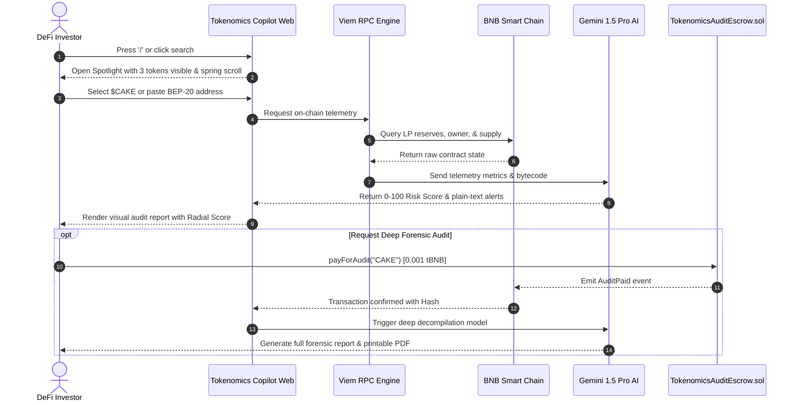

# User Flow & Interaction Lifecycle

Tokenomics Copilot is engineered with an emphasis on friction-free speed, combining keyboard accessibility (`/` shortcut) with rigorous on-chain smart contract validation.

## Step 1: Spotlight Discovery
- User accesses the home dashboard.
- Clicking the search bar or typing `/` activates the **Spotlight Command Palette**.
- The palette opens with 3 top tokens visible, styled in frosted VisionOS glass.
- User can use the keyboard arrows `↑` / `↓` or mouse scroll to navigate through all 23+ pre-indexed tokens.

## Step 2: Instant Surface Audit
- Selecting a token triggers a sub-second query via Viem directly to the BNB Smart Chain RPC node.
- Real-time data collected:
  - Total circulating vs locked supply.
  - Liquidity pool lock expiration timestamp.
  - Top 10 wallet balances (Whale concentration).
  - Renounced ownership & mint function flags.

## Step 3: Algorithmic & AI Analysis
- The raw metrics are evaluated against our proprietary mathematical risk rubric.
- Gemini 1.5 Pro parses the smart contract source code to check for reentrancy bugs, hidden transfer fees, and blacklist functions.
- The resulting composite score (0–100) is visually animated on an SVG radial gauge.

## Step 4: Web3 On-Chain Micropayment
- Users desiring institutional-grade deep decompilation pay a nominal 0.001 tBNB fee.
- The transaction interacts directly with `TokenomicsAuditEscrow.sol`, ensuring immutable, decentralized record-keeping.
